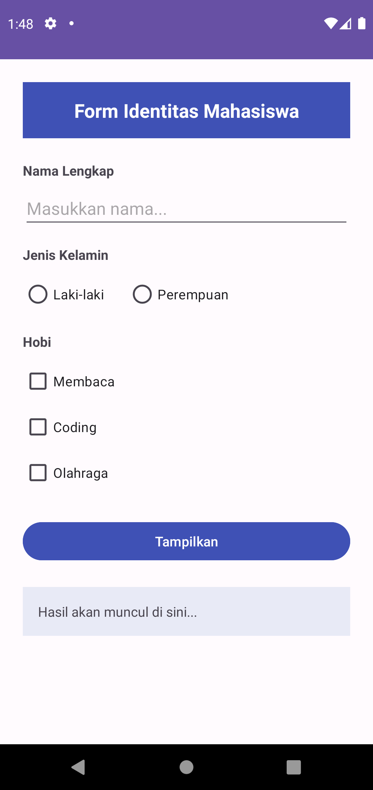

# T3-mobile: Tugas Praktikum 3 - Pemrograman Mobile
* **Nama:** Nur Adinda Juniarti
* **NIM:** F1D02310129
* **Kelas:** B

## Deskripsi Tugas
Membuat aplikasi Android sederhana yang menampilkan form identitas mahasiswa. Data yang diinputkan akan divalidasi dan ditampilkan secara dinamis di bawah tombol setelah diklik.

## Hasil Aplikasi (Screenshots)

|  |  |  |

